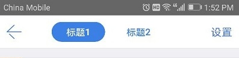
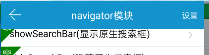
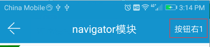
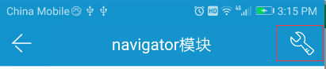
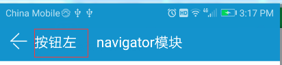

# quick.navigator

## setTitle

设置导航栏标题

注意，页面初始化时会默认读取页面的`title`并自动设置

```js
quick.navigator.setTitle({
    title: '测试标题',
    subTitle: '',
    clickable: 0,
    direction: 'bottom',
    success: function(result) {},
    error: function(error) {}
});

// 兼容快速调用
quick.navigator.setTitle('测试标题');
```


__参数说明__

| 参数 | 参数类型 | 说明 |
| :------------- |:-------------:|:-------------|
| title | String | 需要被设置的标题 |
| subTitle | String | 需要被设置的子标题 |
| clickable | Number | 是否可点击，如果为`1`，代表可点击，会在标题右侧出现一个下拉图标，并且能被点击监听，如果为`0`，永远不会走到回调函数，默认为`0` |
| direction | String | 箭头的朝向，默认为`bottom`朝下，使用`top`时朝上 |

__环境支持__

`quick`

## setMultiTitle

设置多个标题（会覆盖原有的标题）

```js
quick.navigator.setMultiTitle({
    titles: ['tab1', 'tab2'],
    success: function(result) {
        /**
         * 每一次点击tab都会触发
         * {
                which: 0
           }
         */
    },
    error: function(error) {}
});
```



__参数说明__

| 参数 | 参数类型 | 说明 |
| :------------- |:-------------:|:-------------|
| titles | Array[String] | 需要被设置的标题数组 |

__返回说明__

| 参数 | 参数类型 | 说明 |
| :------------- |:-------------:|:-------------|
| which | Number | 当前被点击的是哪一个标题，譬如`0`是第`1`个，`1`是第`2`个 |

__环境支持__

`quick`

## show

显示原生导航栏

```js
quick.navigator.show({
    success: function(result) {},
    error: function(error) {}
});
```

__环境支持__

`quick`

## hide

隐藏原生导航栏

```js
quick.navigator.hide({
    success: function(result) {},
    error: function(error) {}
});
```


__环境支持__

`quick`

## showStatusBar

显示状态栏

```js
quick.navigator.showStatusBar({
    success: function(result) {},
    error: function(error) {}
});
```

__环境支持__

`quick`

## hideStatusBar

隐藏状态栏

```js
quick.navigator.hideStatusBar({
    success: function(result) {},
    error: function(error) {}
});
```



__环境支持__

`quick`

## hookSysBack

拦截`Android`中的系统返回，拦截后原有返回功能不再有

```js
quick.navigator.hookSysBack({
    success: function(result) {
        /**
         * Android中每一次按下系统返回就会触发回调
         */
    },
    error: function(error) {}
});
```

__环境支持__

`quick-Android`

## hookBackBtn

拦截导航栏左侧的返回按钮，拦截后原有返回功能不再有

```js
quick.navigator.hookBackBtn({
    success: function(result) {
        /**
         * 每一次按下导航栏左侧返回就会触发回调
         */
    },
    error: function(error) {}
});
```


__环境支持__

`quick`

## setRightBtn

设置右侧第`which`个按钮，并且监听

```js
quick.navigator.setRightBtn({
    isShow: 1,
    text: '按钮右1',
    // 设置图片的优先级会较高
    //imageUrl: 'http://app.epoint.com.cn/staticResource/testicon2.png',
    which: 0,
    success: function(result) {
        /**
         * 按钮点击后回调
         */
    },
    error: function(error) {}
});
```

右侧第一个





右侧第二个


__参数说明__

| 参数 | 参数类型 | 说明 |
| :------------- |:-------------:|:-------------|
| isShow | Number | 是否显示，`1`代表显示，`0`代表隐藏，默认为`1` |
| text | String | 按钮的文本 |
| imageUrl | String | 按钮的图片，如果设置图片了，会优先显示(覆盖原有的文本) |
| which | Number | 默认为`0`，代表需要操作的是右侧第几个按钮，从最右侧开始算 |

__环境支持__

`quick`

## setLeftBtn

设置左侧按钮，并且监听

根据[钉钉导航栏设计规范](https://open-doc.dingtalk.com/docs/doc.htm?spm=a219a.7629140.0.0.Y9Lijn&treeId=171&articleId=104928&docType=1#setTitle)，
钉钉中左侧按钮只在`iOS`中有效

```js
quick.navigator.setLeftBtn({
    isShow: 1,
    text: '按钮左',
    // 设置图片的优先级会较高
    //imageUrl: 'http://app.epoint.com.cn/staticResource/testicon2.png',
    // 是否显示下拉箭头,如果带箭头，它会占两个位置，同时覆盖左侧按钮和左侧返回按钮
    isShowArrow: 0
    success: function(result) {
        /**
         * 按钮点击后回调
         */
    },
    error: function(error) {}
});
```




__参数说明__

| 参数 | 参数类型 | 说明 |
| :------------- |:-------------:|:-------------|
| isShow | Number | 是否显示，`1`代表显示，`0`代表隐藏，默认为`1` |
| text | String | 按钮的文本 |
| imageUrl | String | 按钮的图片，如果设置图片了，会优先显示(覆盖原有的文本) |
| isShowArrow | Number | 默认为`0`，是否显示下拉图标，如果显示(`1`)代表是主操作键，会同时占有左侧按钮和左侧返回按钮的位置 |

__环境支持__

`quick`

## setRightMenu

设置右侧下拉菜单，并且监听

注意，会覆盖右侧按钮`1`

```js
var iconSrc = 'http://app.epoint.com.cn/staticResource/img_head.png';

quick.navigator.setRightMenu({
    isShow: 1,
    text: '下拉',
    // 设置图片的优先级会较高
    //imageUrl: 'http://app.epoint.com.cn/staticResource/testicon2.png',
    titleItems: ['按钮1', '按纽2'],
    iconItems: [iconSrc, iconSrc],
    success: function(result) {
        /**
         * 按钮点击后回调
         * {
                which: 0, // 点击的下拉按钮index，从0开始
                content: '按钮1' // 点击的按钮的对应文本
           }
         */
    },
    error: function(error) {}
});
```


__参数说明__

| 参数 | 参数类型 | 说明 |
| :------------- |:-------------:|:-------------|
| isShow | Number | 是否显示，`1`代表显示，`0`代表隐藏，默认为`1` |
| text | String | 定位按钮的文本 |
| imageUrl | String | 定位按钮的图片，如果设置图片了，会优先显示(覆盖原有的文本) |
| titleItems | Array[String] | 下拉按钮的文本数组 |
| iconItems | Array[String] | 下拉按钮的图片数组 |

__返回说明__

| 参数 | 参数类型 | 说明 |
| :------------- |:-------------:|:-------------|
| which | Number | 被点击按钮的索引值，从0开始 |
| content | String | 按钮对应的文本 |

__环境支持__

`quick`
