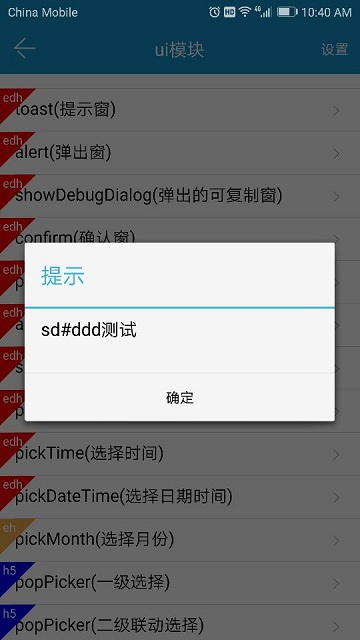
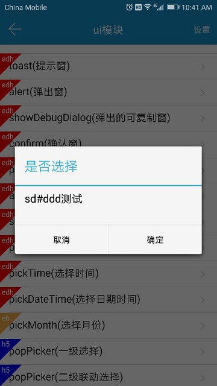
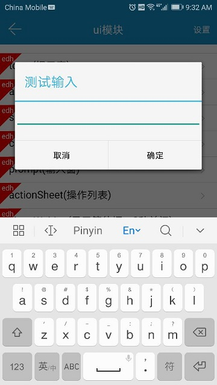
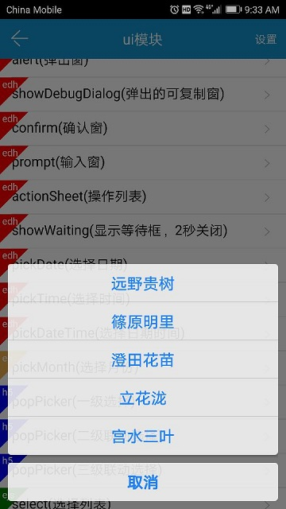
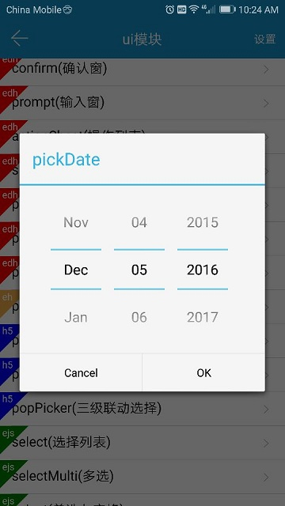
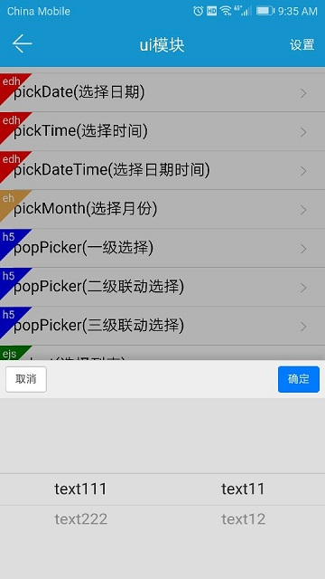
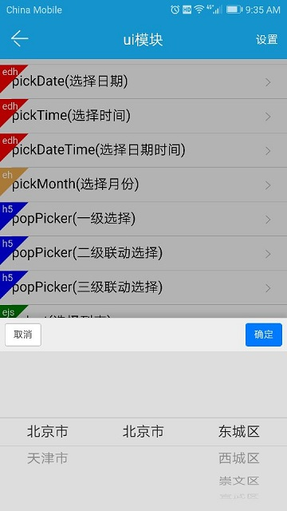
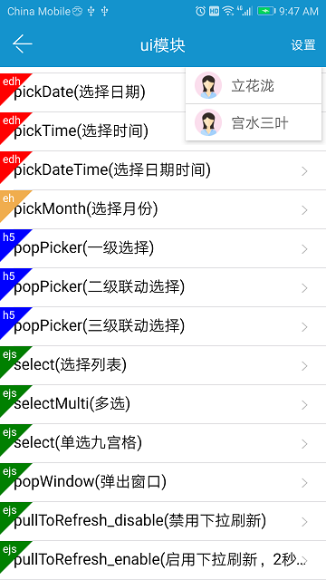

# quick.ui

## toast

```js
quick.ui.toast({
    message: "sd#ddd测试",
    success: function(result) {},
    error: function(err) {}
});

// 兼容快速调用
quick.ui.toast(message);
```


__参数说明__

| 参数 | 参数类型 | 说明 |
| :------------- |:-------------:|:-------------|
| message | String | 消息内容 |

__环境支持__

`H5`、`quick`

## alert

```js
quick.ui.alert({
    title: "标题",
    message: "信息",
    buttonName: "确定",
    cancelable: 1,
    success: function(result) {
        // 点击 alert的按钮后回调
    },
    error: function(err) {}
});

// 兼容快速调用
quick.ui.alert(message, title, buttonName);
```



__参数说明__

| 参数 | 参数类型 | 说明 |
| :------------- |:-------------:|:-------------|
| title | String | 消息标题 |
| message | String | 消息内容 |
| buttonName | String | 确定按钮的文字 |
| cancelable | Number | 是否点击可取消，为`1`为可取消，默认为`1` |

__环境支持__

`H5`、`quick`


## confirm

```js
quick.ui.confirm({
    title: "是否选择",
    message: "sd#ddd测试",
    buttonLabels: ['取消', '确定'],
    cancelable: 1,
    success: function(result) {
        // 点击任意一个按钮都会回调     
        /*
        {
            which: 0 //被点击按钮的索引值，Number类型，从0开始           
        }
        */
    },
    error: function(err) {}
});
```



__参数说明__

| 参数 | 参数类型 | 说明 |
| :------------- |:-------------:|:-------------|
| title | String | 标题 |
| message | String | 消息说明 |
| buttonLabels | Array[String] | 按钮名称 |
| cancelable | Number | 是否点击可取消，为`1`为可取消，默认为`1` |

__返回说明__

| 参数 | 参数类型 | 说明 |
| :------------- |:-------------:|:-------------|
| which | Number | 被点击按钮的索引值，从0开始 |

__环境支持__

`H5`、`quick`

## prompt

```js
quick.ui.prompt({
    title: "测试输入",
    hint: "",
    text: "",
    lines: 1,
    maxLength: 10000,
    buttonLabels: ['取消', '确定'],
    cancelable: 1,
    success: function(result) {
        // 点击任意一个按钮都会回调     
        /*
        {
            which: 0， //被点击按钮的索引值，Number类型，从0开始
            content: '' // 输入的内容
        }
        */
    },
    error: function(err) {}
});
```



__参数说明__

| 参数 | 参数类型 | 说明 |
| :------------- |:-------------:|:-------------|
| title | String | 标题 |
| hint | String | 输入框提示 |
| text | String | 输入框默认的文本，默认为空 |
| lines | Number | 最多允许的输入行数，默认为`1` |
| maxLength | Number | 最多允许的输入字符个数，默认为`10000` |
| buttonLabels | Array[String] | 按钮名称数组 |
| cancelable | Number | 是否点击可取消，为`1`为可取消，默认为`1` |

__返回说明__

| 参数 | 参数类型 | 说明 |
| :------------- |:-------------:|:-------------|
| which | Number | 被点击按钮的索引值，从0开始 |
| content | String | 输入的内容 |

__环境支持__

`H5`、`quick`

## showWaiting

显示等待对话框

注意，同时只会存在一个等待对话框

```js
quick.ui.showWaiting({
    message: '正在加载...'
    success: function(result) {},
    error: function(err) {}
});

// 兼容快速调用
quick.ui.showWaiting('正在加载...');
```


__参数说明__

| 参数 | 参数类型 | 说明 |
| :------------- |:-------------:|:-------------|
| message | String | 显示的信息，默认为`加载中...` |

__环境支持__

`H5`、`quick`

## closeWaiting

关闭等待对话框

```js
quick.ui.closeWaiting({
    success: function(result) {},
    error: function(err) {}
});
```

__环境支持__

`H5`、`quick`

## actionSheet

操作列表

```js
quick.ui.actionSheet({
    items: ['远野贵树', '篠原明里', '澄田花苗', '立花泷', '宫水三叶'],
    cancelable: 1,
    success: function(result) {
        // 点击任意一个按钮都会回调     
        /*
        {
            which: 0， //被点击按钮的索引值，Number类型，从0开始
            content: '' // 对应的内容
        }
        */
    },
    error: function(err) {}
});
```



__参数说明__

| 参数 | 参数类型 | 说明 |
| :------------- |:-------------:|:-------------|
| items | Array[String] | 内容数组 |
| cancelable | Number | 是否点击可取消，为`1`为可取消，默认为`1` |

__返回说明__

| 参数 | 参数类型 | 说明 |
| :------------- |:-------------:|:-------------|
| which | Number | 被点击按钮的索引值，从0开始 ,如果是`-1`代表点击了取消按钮|
| content | String | 选择的内容 |

__环境支持__

`H5`、`quick`

## pickDate

选择日期

```js
quick.ui.pickDate({
    title: 'pickDate',
    datetime: '2016-12-05',
    success: function(result) {
        /*
        {
            date: '2016-12-05' 
        }
        */
    },
    error: function(err) {}
});
```



__参数说明__

| 参数 | 参数类型 | 说明 |
| :------------- |:-------------:|:-------------|
| title | String | 标题，部分设备上设置标题后遮挡控件可不设置标题 |
| datetime | String | 默认的时间，默认值为当前时间，格式为`yyyy-MM-dd` |

__返回说明__

| 参数 | 参数类型 | 说明 |
| :------------- |:-------------:|:-------------|
| date | String | 选择的日期 |

__环境支持__

`H5`、`quick`

## pickTime

选择时间

```js
quick.ui.pickTime({
    title: 'pickTime',
    datetime: '10:20',
    success: function(result) {
        /*
        {
            time: '10:20' 
        }
        */
    },
    error: function(err) {}
});
```


__参数说明__

| 参数 | 参数类型 | 说明 |
| :------------- |:-------------:|:-------------|
| title | String | 标题，部分设备上设置标题后遮挡控件可不设置标题 |
| datetime | String | 默认的时间，默认值为当前时间，格式为`HH:mm` |

__返回说明__

| 参数 | 参数类型 | 说明 |
| :------------- |:-------------:|:-------------|
| time | String | 选择的时间|

__环境支持__

`H5`、`quick`

## pickDateTime

选择日期时间

```js
quick.ui.pickDateTime({
    title1: '选择日期',
    title2: '选择时间',
    datetime: '2016-12-05 10:20',
    success: function(result) {
        /*
        {
            datetime: '2016-12-05 10:20' 
        }
        */
    },
    error: function(err) {}
});
```

__参数说明__

| 参数 | 参数类型 | 说明 |
| :------------- |:-------------:|:-------------|
| title1 | String | 选择日期的标题 |
| title2 | String | 选择时间的标题 |
| datetime | String | 默认的时间，默认值为当前时间，格式为`yyyy-MM-dd HH:mm` |

__返回说明__

| 参数 | 参数类型 | 说明 |
| :------------- |:-------------:|:-------------|
| datetime | String | 选择的日期时间|

__环境支持__

`H5`、`quick`

## pickMonth

选择月份

```js
quick.ui.pickMonth({
    title: '选择月份',
    datetime: '2017-06',
    success: function(result) {
        /*
        {
            month: '2016-06' 
        }
        */
    },
    error: function(err) {}
});
```


__参数说明__

| 参数 | 参数类型 | 说明 |
| :------------- |:-------------:|:-------------|
| title | String | 标题，部分设备上设置标题后遮挡控件可不设置标题 |
| datetime | String | 默认的时间，默认值为当前时间，格式为`yyyy-MM` |

__返回说明__

| 参数 | 参数类型 | 说明 |
| :------------- |:-------------:|:-------------|
| month | String | 选择的月份 |

__环境支持__

`H5`


## popPicker

选择器，目前支持`1-3`级别的选择

__一级选择__

```js
quick.ui.popPicker({
    layer: 1,
    data: [{
        value: 'value1',
        text: 'text1'
    },
    {
        value: 'value2',
        text: 'text2'
    }],
    success: function(result) {
        /*
        {
            // 选择的对象
            items: [{text: "text1", value: "value1"}] 
        }
        */
    },
    error: function(err) {}
});
```


__二级选择__

```js
quick.ui.popPicker({
    layer: 2,
    data: [{
        value: 'value111',
        text: 'text111',
        children: [{
            value: 'value11',
            text: 'text11',
        },
        {
            value: 'value12',
            text: 'text12',
        }]
    },
    {
        value: 'value222',
        text: 'text222',
        children: [{
            value: 'value21',
            text: 'text21',
        },
        {
            value: 'value22',
            text: 'text22',
        }]
    }],
    success: function(result) {
        /*
        {
            // 选择的对象
            items: [{text: 一级xxx, value: 一级xxx}, {text: 二级xxx, value: 二级xxx}] 
        }
        */
    },
    error: function(err) {}
});
```



__二级选择__

由于数据较多，不再演示，使用和上述类似，只不过`data`变成三级数组



__参数说明__

| 参数 | 参数类型 | 说明 |
| :------------- |:-------------:|:-------------|
| layer | Number | 层级，默认为`1` |
| data | Array[String] | 选择器的数据，不同层次的数据格式不一样 |

__返回说明__

| 参数 | 参数类型 | 说明 |
| :------------- |:-------------:|:-------------|
| items | String | 选择的对象，格式为 `[{text: 一级xxx, value: 一级xxx}, ..., {text: N级xxx, value: n级xxx}] `|

__环境支持__

`H5`

## popWindow

弹出窗口

```js
var iconSrc = 'http://app.epoint.com.cn/staticResource/img_head.png';

quick.ui.popWindow({
    titleItems: ['立花泷', '宫水三叶'],
    iconItems: [iconSrc, iconSrc],
    iconFilterColor: "",
    success: function(result) {
        /*
        {
            which: 0, // 选择的index，从 0开始
            content: '' //选择的内容
        }
        */
    },
    error: function(err) {}
});
```



__参数说明__

| 参数 | 参数类型 | 说明 |
| :------------- |:-------------:|:-------------|
| titleItems | Array[String] | 标题数组 |
| iconItems | Array[String] | 图片数组，只支持网络图片 |
| iconFilterColor | String | 过滤色，默认为空，填写过滤色后，图片中非透明的地方都会变为过滤色 |

__返回说明__

| 参数 | 参数类型 | 说明 |
| :------------- |:-------------:|:-------------|
| which | Number | 被点击按钮的索引值，从0开始 |
| content | String | 选择的内容 |

__环境支持__

`quick`