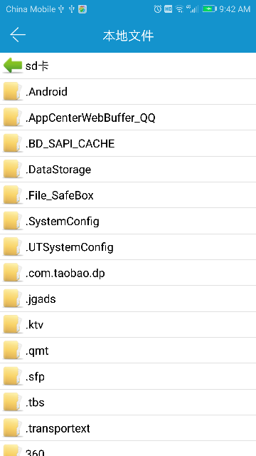

# quick.util

## scan

打开二维码扫描

```js
quick.util.scan({
    success: function(result) {
        /**
         * 扫描成功后返回
         * {
                resultData: '二维码扫描后的字符串'
           }
         */
    },
    error: function(error) {}
});
```

__返回说明__

| 参数 | 参数类型 | 说明 |
| :------------- |:-------------:|:-------------|
| resultData | String | 二维码扫描后解析出的字符串 |

__环境支持__

`quick`

## selectImage

从相册中选择图片

```js
quick.util.selectImage({
    photoCount: 9,
    showGif: 0,
    previewEnabled: 1,
    selectedPhotos: ["/storage/emulated/0/DCIM/Camera/IMG_20170703_133717.jpg"],
    success: function(result) {
        /**
         * 选择完图片后返回
         * {
                resultData: ["/storage/emulated/0/DCIM/Camera/IMG_20170703_133717.jpg"] // 返回图片的本地路径数组
           }
         */
    },
    error: function(error) {}
});
```


__参数说明__

| 参数 | 参数类型 | 说明 |
| :------------- |:-------------:|:-------------|
| photoCount | Number | 选择图片的最大允许数量，默认为`9` |
| showGif | Number | 是否允许选择`gif`图，`1`为显示，`0`为不显示，默认为`0` |
| previewEnabled | Number | 是否允许预览图片，`1`为允许，`0`为不允许，默认为`1` |
| selectedPhotos | Array[String] | 已选的图片数组(本地路径)，传了后，对应路径的图片会变为选择状态 |

__返回说明__

| 参数 | 参数类型 | 说明 |
| :------------- |:-------------:|:-------------|
| resultData | Array[String] | 返回图片的本地路径数组 |


__环境支持__

`quick`

## cameraImage

拍照获取图片

```js
quick.util.cameraImage({
    width: 720,
    quality: 70,
    success: function(result) {
        /**
         * 拍完照后返回
         * {
                resultData: "/storage/emulated/0/DCIM/Camera/IMG_20170703_133717.jpg" // 返回图片的本地路径
           }
         */
    },
    error: function(error) {}
});
```

__参数说明__

| 参数 | 参数类型 | 说明 |
| :------------- |:-------------:|:-------------|
| width | Number | 照片的宽度，默认为`720` |
| quality | Number | 照片的压缩质量，百分比，默认为`70` |

__返回说明__

| 参数 | 参数类型 | 说明 |
| :------------- |:-------------:|:-------------|
| resultData | String | 返回图片的本地路径 |

__环境支持__

`quick`

## selectFile

选择文件

```js
quick.io.selectFile({
    success: function(result) {
        /**
         * 选择文件后返回
         * {
                resultData: "/storage/emulated/0/DCIM/Camera/IMG_20170703_133717.jpg" 
           }
         */
    },
    error: function(error) {}
});
```



__返回说明__

| 参数 | 参数类型 | 说明 |
| :------------- |:-------------:|:-------------|
| resultData | String | 返回文件的本地路径|

__环境支持__

`quick`


## openFile

打开本地文件

```js
quick.io.openFile({
    path: "/storage/emulated/0/DCIM/Camera/IMG_20170703_133717.jpg",
    success: function(result) {},
    error: function(error) {}
});
```

__参数说明__

| 参数 | 参数类型 | 说明 |
| :------------- |:-------------:|:-------------|
| path | String | `必填`，需要被打开的本地文件路径，`/storage`开头的这种 |

__环境支持__

`quick`
